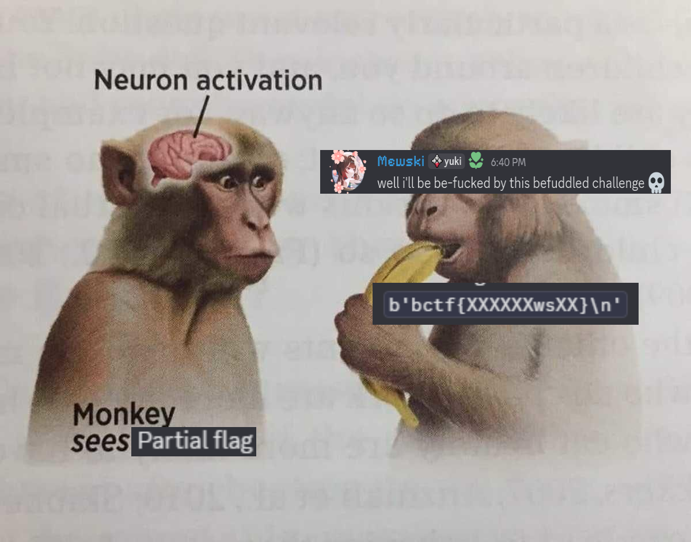

+++
date = '2025-11-10T09:38:59+01:00'
draft = false
title = 'Befuddled / Befucked'
author = ["Sibech", "Rabjho"]
tags = ["rev", "unintended"]
ctf = "BuckeyeCTF2026"
+++

Befuddled had one of the unintendeds of all time, all it took was a dream, GDB and persistence.
What might come to annoy the authors is that befucked also had an unintended solution...

Tl;DR at the bottom.

## Befuddled

> We got this binary from another dimension! We're honestly not even sure how it was produced...

> Authors: fisher792, jm8
>
> Category: rev
>
> Solves: 34

Decompiling the binary regularly reveals nothing of use. We try Ghidra, Cutter, Ida, Binja, all the usual suspects. Not one of them give anything really useful. Some give a main function, some give a handful of functions total, others give a lot.

What is going on? And why does it look like a rop chain? None of this is making sense.

By running `strings` on the binary we find `NOPE!!!!!!` and `CORRECT!!!`. Looks like its a flag checker then.

> Can we quickly use angr with the strings as constraints and one-shot the flag?

Answer: No the simplest angr-script on the planet couldn't find the flag.

> Bare minimum static analysis has failed us.

Naturally, we turn to dynamic reversing with our lord and savior GDB.

Initially, we had no clue how the binary worked. Actually we still don't. Anyway, we just gave it `A` as an input and stepped-along. We noticed that some magic value was subtracted from our input and it underflowed, such that `rax` was `0xffffffffffffffc4`, when we hit a `test rax rax` instruction. Stepping further along, the `test` resulted in not branching, and a few returns down the line we see `NOPE!!!!!!` being spelled out on the stack.

> Hmm, not good. What if we give input such that `rax=0x0`, which results in taking the other branch? Doing the maths gave us `0x7d="}"`. Wait is that the end of the flag? Okay might be in reverse; we give the next character expecting another underflow, but wait the first check fails now? Prepend the new character maybe?

Sure enough that gives us `0x33="3"`.

Well that's weird? Thinking about it for a bit we realise that we can't think. The only solution: MORE GDB!!! We throw down a breakpoint on each `syscall` instruction, and go hunting for where it calls `sys_read`. Annoyingly, one of the `syscall`'s is used for `sys_write` and it interrupts like 30 times. Side note: This was about when we began automatically sending `continue` to GDB. After removing that breakpoint we find `sys_read`, but it's only reading one byte in? Oh it's looping until it reads `0x0a="\n"`, and pushing the bytes to the stack one at a time. Later when a byte is checked it gets popped from the stack.

> Okay, so that's why we need to prepend. Perfect, just go byte-by-byte and go-flag, right?

Sort of. We managed to reach `mp1labl3}`, but for the next byte after that we didn't hit the usual `test` instruction, which resulted in us jumping straight to `NOPE!!!!!!`. The solution? More breakpoints! All `test` instructions in the binary got its own breakpoint.

We discovered, that when we gave an even byte we were sent straight to `NOPE!!!!!!`, but not when we gave an odd byte.

> Oh hell nah, what is this bizzaro shit? Actually... that might spell "uncompilable"?

So we try a filler byte and try the next character. We're back babyyyy, our oracle is working again. Don't know why, don't care why.


Soon after, already at `_unC0mp1labl3}` the oracle breaks again. Alright, let's put in a few more bytes until we get back to our breakpoints. Luv me breakpoints. We do this process until we have `bctf{XXmPIle_Th3_unC0mp1labl3}`, where the Xs are unknown. Enough GDB'ing back to guessing (_the best part of flag checker challs_) by running the binary to confirm the last two bytes until we hit `CORRECT!!!`.

Anyways, here is the final solve script (reader discretion advised).

```python
from pwn import *

elf = context.binary = ELF("befuddled", checksec=False)
context.log_level = 'info'

def start(argv=[], *a, **kw):
    if args.GDB:
        return gdb.debug(elf.path, gdbscript=gdbscript)
    elif args.REMOTE:
        return remote("address", 12345)
    else:
        return process(elf.path)

# b *0x40100f
# b *0x401092
# b *0x4010d4
# b *0x4011da

"""
b *0x4011a9
b *0x4011c2

b *0x401010
b *0x401093
b *0x4010d5
b *0x4011aa
b *0x4011c3
b *0x4011db
b *0x4012a0
b *0x4012bb
"""

# b *0x401238 sys_write
# b *0x401263 sys_read
# b *0x4012f9 sys_exit

"""
b *0x40116c
b *0x40100f
b *0x401092
b *0x4010d4
"""

gdbscript = '''
init-pwndbg
b *0x40129f
b *0x4011da
b *0x4012ba

b *0x4011c2
b *0x4011a9

b *0x401010
b *0x401093
b *0x4010d5
b *0x4011aa
b *0x4011c3
b *0x4011db
b *0x4012a0
b *0x4012bb

b *0x40100f
b *0x401092
b *0x4010d4
b *0x4011da

continue
c
c
c
c
c
c
c
c
c
c
c
c
c
c
c
c
'''.format(**locals())

io = start()

#key = b"\x6c\x33\x7d\x0a\x7d\x0a"
#key = b"\x6d\x70\x31\x6c\x61\x62\x6c\x33\x7d\x0a"
key = b"\x44\x6a\x6d\x50\x49\x6c\x65" + b"\x5f\x54\x68\x33" + b"\x5f\x75\x6e\x43\x30\x6d\x70\x31\x6c\x61\x62\x6c\x33\x7d\x0a"
#key = b"\x0a\x7d\x33\x6c\x62\x61\x6c\x31\x70\x6d"
#key += key

key = b"\x62\x63\x74\x66\x7b" + b"\x63\x30\x6d\x50\x49\x6c\x65" + b"\x5f\x54\x68\x33" + b"\x5f\x75\x6e\x43\x30\x6d\x70\x31\x6c\x61\x62\x6c\x33\x7d\x0a"

io.sendafter(b": ", key)

print(key)

io.interactive()
```

## Befucked

> @everyone New revenge challenge
>
> 

> Authors: fisher792, jm8
>
> Category: rev
>
> Solves: 7

Fuck, a new challenge this late in the CTF. Or rather befucked.

### Doing the same as befuddled.

Running the binary looks more or less the same as the first one, so far so good. Decompiling it looks fine as well. We still have the three syscalls, we still have a good bunch of `test rax rax` instructions. Naturally, we go back to our good'ol' good'ol' and set new breakpoints in GDB.

Trying to solve the challenge the same as before was not good. We only get to `0x7d="}"` with our `test` oracle before we have to guess. Fuckfuckfuckfuckfuck...

Hmm okay let's just continue with placeholders until we get another `test` oracle. After two placeholders total we get our oracle back and can proceed to get two proper bytes of the flag, `wsXX}`. Now it is time for round two of GDB gambling.


### Panic

We get 1, 2, then 3, then 4 bytes of nonsense. Panic sets in about here:

> Did the authors fix the challenge?
> Did we follow the same solution as before?
> Are we fucked?

Until we after 6 total bytes of nonsense see a byte we love `0x7b`, our beloved `{`, the ending of the beginning, now slightly less panicked. The next 4 bytes we can confirm with our `test` oracle are `bctf` as we expect. But, we're still left at `bctf{XXXXXXwsXX}`.

For thoroughness and torture of you, here is the script, now with even more `continue` GDB goodness compared to befuddled.

```python
from pwn import *

elf = context.binary = ELF("befucked", checksec=False)
context.log_level = 'info'

def start(argv=[], *a, **kw):
    if args.GDB:
        return gdb.debug(elf.path, gdbscript=gdbscript)
    elif args.REMOTE:
        return remote("address", 12345)
    else:
        return process(elf.path)

# b *0x00401238 sys_write
# b *0x00401263 sys_read
# b *0x004012f9 sys_exit (presumed)

gdbscript = """
init-pwndbg
b *0x0040100f
b *0x00401010
b *0x00401092

b *0x00401093
b *0x004010d4

b *0x004010d5
b *0x004011a9
b *0x004011aa
b *0x004011c2
b *0x004011c3
b *0x004011da
b *0x004011db
b *0x0040129f

b *0x004012a0
b *0x004012ba
b *0x004012bb
b *0x00401404

continue
c
c
c
c
c
c
c
c
c
c
c
c
c
c
c
c
c
c
c
c
c
c
c
c
c
c
c
c
c
c
c
c
c
c

""".format(**locals())

io = start()


# Partial key
# key = b"\x62\x63\x74\x66\x7b" b"\x36\x35\x34\x33\x32\x31" b"\x77\x73" + b"\x32\x31" + b"\x7d\x0a"

key = b"\x62\x63\x74\x66\x7b" b"\x36\x35\x34\x33\x4d\x65" b"\x77\x73" + b"\x6b\x69" + b"\x7d\x0a"


io.sendafter(b": ", key)

print(key)

io.recvall()
```

### Neuron activation



> The `ws` we know are two bytes away from the end, that fits with the flag ending in `Mewski`. Also maybe the flag starts with `fuck` like the challenge hints?

A LLM-slop itertools-script and a short while later with looking for casing and leetspeak variants of all the unknown letters, we know that is not the case...

Slop script, not for sore eyes:

```python
#!/usr/bin/env python3

import itertools
import os

from pwn import *


def generate_leet_char_variants(char):
    """Generate leet speak variants for a single character"""
    leet_map = {
        "a": ["a", "@", "4", "A"],
        "e": ["e", "3", "E", "&"],
        "i": ["i", "1", "!", "I"],
        "o": ["o", "0", "O"],
        "s": ["s", "5", "$", "S"],
        "t": ["t", "7", "T"],
        "l": ["l", "1", "L", "7", "2", "€", "|"],
        "g": ["g", "9", "G"],
        "b": ["b", "6", "B"],
        "z": ["z", "2", "Z"],
        "u": ["u", "U"],
        "c": ["c", "C", "(", "["],
        "k": ["k", "K"],
        "f": ["f", "F"],
        "m": ["m", "M"],
        "w": ["w", "W"],
        "n": ["n", "N"],
        "r": ["r", "R"],
        "d": ["d", "D"],
        "p": ["p", "P"],
        "v": ["v", "V"],
        "h": ["h", "H"],
        "j": ["j", "J"],
        "q": ["q", "Q"],
        "x": ["x", "X"],
        "y": ["y", "Y"],
    }

    char_lower = char.lower()
    if char_lower in leet_map:
        return leet_map[char_lower]
    else:
        return [char.lower(), char.upper()]


def test_flag(flag):
    """Test a flag against the binary"""
    try:
        p = process("./befucked", level="error")  # Suppress output
        p.recvuntil(b": ")
        p.sendline(flag.encode())

        response = p.recvall(timeout=1)
        p.close()

        return response
    except Exception:
        return b""


def main():
    # Template: bctf{XXXXXXwsXX}
    # Known:    bctf{fuckMewski}
    # So X positions are: f,u,c,k,M,e at positions 0-5, and s,k at positions 8-9

    # The known flag is: fuckMewski
    # Template positions: fuckMe ws ki
    # X positions:        012345    89

    known_flag = "fuckMewski"
    x_positions = [0, 1, 2, 3, 4, 5, 8, 9]  # positions of X in the template
    x_chars = [known_flag[i] for i in x_positions]  # ['f','u','c','k','M','e','s','k']

    print("[*] Original characters at X positions:", "".join(x_chars))
    print("[*] Generating variants for each position...")

    # Generate variants for each X position
    variants_per_position = []
    for i, char in enumerate(x_chars):
        variants = generate_leet_char_variants(char)
        variants_per_position.append(variants)
        print(
            f"    Position {x_positions[i]} ('{char}'): {len(variants)} variants {variants}"
        )

    # Calculate total combinations
    total = 1
    for variants in variants_per_position:
        total *= len(variants)

    print(f"\n[*] Total combinations to test: {total:,}")

    if total > 50000:
        print("[!] Warning: Large number of combinations. Consider reducing variants.")
        response = input("Continue? (y/n): ")
        if response.lower() != "y":
            return

    print("[*] Starting brute force attack...\n")

    count = 0
    start_time = time.time()

    # Generate all combinations
    for combo in itertools.product(*variants_per_position):
        count += 1

        # Construct the flag
        # Template: bctf{XXXXXXwsXX}
        # Positions: 012345  89
        flag_chars = list("fuckMewski")
        for i, new_char in enumerate(combo):
            flag_chars[x_positions[i]] = new_char

        flag = "bctf{" + "".join(flag_chars) + "}"

        if count % 500 == 0 or count <= 10:
            elapsed = time.time() - start_time
            rate = count / elapsed if elapsed > 0 else 0
            print(
                f"[*] {count:,}/{total:,} ({count / total * 100:.1f}%) - {rate:.0f}/sec - Current: {flag}"
            )

        response = test_flag(flag)

        # Check for success indicator
        if b"NOPE" not in response:
            print(f"\n[+] SUCCESS! Found correct flag: {flag}")
            print(f"[+] Response: {response}")
            return flag

        # Check for any other interesting responses (optional debugging)
        elif (
            response and len(response.strip()) > 5 and count <= 20
        ):  # Only show first few for debugging
            print(f"[?] Response for {flag}: {response}")

    elapsed = time.time() - start_time
    print(
        f"\n[*] Completed {total:,} attempts in {elapsed:.1f} seconds ({count / elapsed:.0f} attempts/sec)"
    )
    print("[-] No success found in tested variants.")
    return None


if __name__ == "__main__":
    import time

    # Test if binary exists first
    if not os.path.exists("./befucked"):
        print("[!] Binary './befucked' not found!")
        print("[!] Make sure the binary is in the current directory")
        exit(1)

    print("[*] Testing basic connectivity with original flag...")
    test_response = test_flag("bctf{fuckMewski}")
    print(f"[*] Response to original flag: {test_response}")
    if b"Correct!!!" in test_response:
        print("[!] Original flag is already correct!")

    print()

    result = main()
    if result:
        print(f"\n[+] Found working flag: {result}")
    else:
        print("\n[-] No working flag found in variants tested")
```

Okay so we try with `love` as that is probably more realistic ❤️. That's not it either ffs. Neither `hate`, `help` and so on.

### 2nd Neuron Activation

> But wait... The previous challenge was in snake_case, with underscores between words. Let's try that! But what might the word be?

> What about `thx`?

One run of idiot.py and all the leetspeek permutations of `bctf{thx_Mewski}` later we get `Correct!!!` with:

`bctf{thx_Mewski}`

> yeah just guessed it and didn't even need the LLM-slop script xd. Flag is flag. EZ 🩸

Sorry to dissapoint you fisher792, we are in fact not the GDB gods that we led you to believe. We are also sry to have fucked over the challenge like this. It seems like it was very good, when done the intentional way ❤️

## TLDR


\+


\+ educated guessing \+ mildly forceful scripts = flag